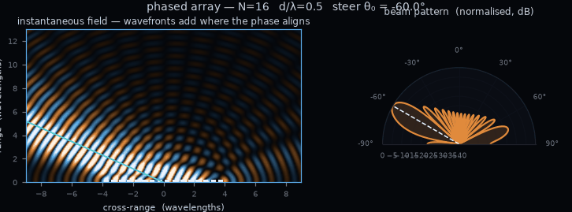

# ⚙️ Engineering Scripts

This repository contains **interactive Python scripts for exploring concepts across multiple STEM fields**, including **signal theory, control theory, mathematics, and physics**. Each script is designed to provide **hands-on experimentation, simulations, and visualizations** to make complex concepts easier to understand.

<p align="center">
  
</p>

## 📂 Repository Structure

* `scripts/` → Collection of Python scripts organized by topic.
* `visualizations/` → Collection of interactive visualizers, one folder per topic.
* `visualizations/algorithm-visualization/` → **Algorithm Visualizer**: an animated, step-by-step player for algorithms and data structures written in C++, covering the whole *Algorithm and Data Structures* programme. Not a notebook like the rest of `scripts/`: it's vanilla HTML/JS with no dependencies — open `web/index.html` by double-clicking it, no setup required. Full docs (architecture, catalogue, how to add an algorithm): [visualizations/algorithm-visualization/GUIDE.md](visualizations/algorithm-visualization/GUIDE.md).

## ⚙️ Setup

Create and activate a Python virtual environment, then install dependencies:

```bash
python -m venv venv
source venv/bin/activate   # Linux / macOS
venv\Scripts\activate      # Windows

pip install -r requirements.txt
```

Run any script from the `scripts` folder:

```bash
python scripts/<topic>/<script_name>.py
```

## 🎯 Purpose

This repository aims to:

* Provide **educational visualizations** for STEM concepts
* Offer **simple, reusable Python examples** for learning and teaching
* Help students and engineers **develop intuition through experimentation**

## 🤝 Contributing

Contributions are welcome! To add a new topic or script:

1. Fork the repository
2. Add your script in the appropriate `scripts/<topic>/` folder
3. Include clear comments and visualizations
4. Open a Pull Request

⭐ If you find this repository useful, consider **starring it**!
